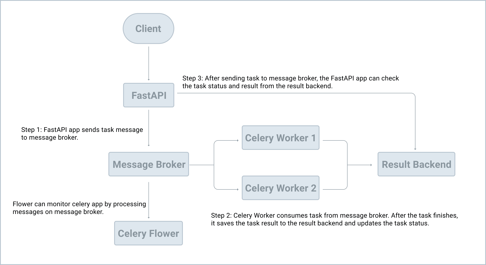

# Introduction
To start fastAPI:
```sh
uvicorn main:app --reload 
```

**What is Celery?**
> Celery is an open source, asynchronous task queue that's often coupled with Python-based web frameworks like FastAPI, Django, or Flask to manage background work outside the typical request/response cycle. In other words, you can return an HTTP response back immediately and run the process as a background task, instead of forcing the user to wait for the task finish.

FastAPI comes with a native background processing toolkit, but Celery is better on:

1. CPU intensive tasks: Celery should be used for tasks that perform heavy background computations since BackgroundTasks runs in the same event loop that serves your app's requests.
2. Task queue: If you require a task queue to manage the tasks and workers, you should use Celery. Often you'll want to retrieve the status of a job and then perform some action based on the status -- i.e., send an error email, kick off a different background task, or retry the task. Celery manages all this for you.


```python
from fastapi import BackgroundTasks


def send_email(email, message):
    pass


@app.get("/")
async def ping(background_tasks: BackgroundTasks):
    background_tasks.add_task(send_email, "email@address.com", "Hi!")
    return {"message": "pong!"}
```

RQ (Redis Queue) and Huey are other open source, Python-based task queues that are often compared to Celery. While the core logic of Celery, RQ, and Huey are very much the same in that they all use the producer/consumer model, they differ in that:
- Both RQ and Huey are much simpler to use and easier to learn than Celery. However, both lack some features and can only be used with Redis.
- Celery is quite a bit more complex and harder to implement and learn, but it's much more flexible and has many more features. It supports Redis along with a number of other backends.

## The Message Broker
The Celery client is the producer which adds a new task to the queue via the message broker. Celery workers then consume new tasks from the queue, again, via the message broker. Once processed, results are then stored in the result backend.

In terms of tools, RabbitMQ is arguably the better choice for a message broker since it supports AMQP (Advanced Message Queuing Protocol) while Redis is fine as your result backend.

To up redis: `podman run -p 6379:6379 --name some-redis -d redis`

## How Celery Works


## Important notes about Celery
To start Celery:
```sh
celery -A main.celery worker --loglevel=info
```

A task has a state `task.state` and a result `task.result`

It is possible to retrieve a Celery task using:
```python
task = AsyncResult('8e3da1cc-a6aa-42ba-ab72-6ca7544d3730')  # replace with your UUID
```

## Flower
Flower is a real-time web application monitoring and administration tool for Celery. To start Flower:

```sh
celery -A main.celery flower --port=5555
```

## Alembic
Alembic is a database migration tool for Python. In this case, we are using SQLite to create the database.

`alembic init alembic` initiates the service

`alembic revision --autogenerate` creates the files to migrate the database

`alembic upgrade head` creates the tables

To interact with the database:

```python
>>> from main import app
>>> from project.database import SessionLocal
>>> from project.users.models import User

>>> user = User(username='test1', email='test1@example.com')
>>> session = SessionLocal()
>>> session.add(user)
>>> session.commit()
>>>
>>> new_session = SessionLocal()
>>> new_session.query(User).first().username
'test1'

>>> exit()
```

# TL;DR commands
Create and use a venv:
```sh
$ python3.11 -m venv venv
$ source venv/bin/activate
(venv)$
```

Run uvcorn locally: `uvicorn main:app --reload`